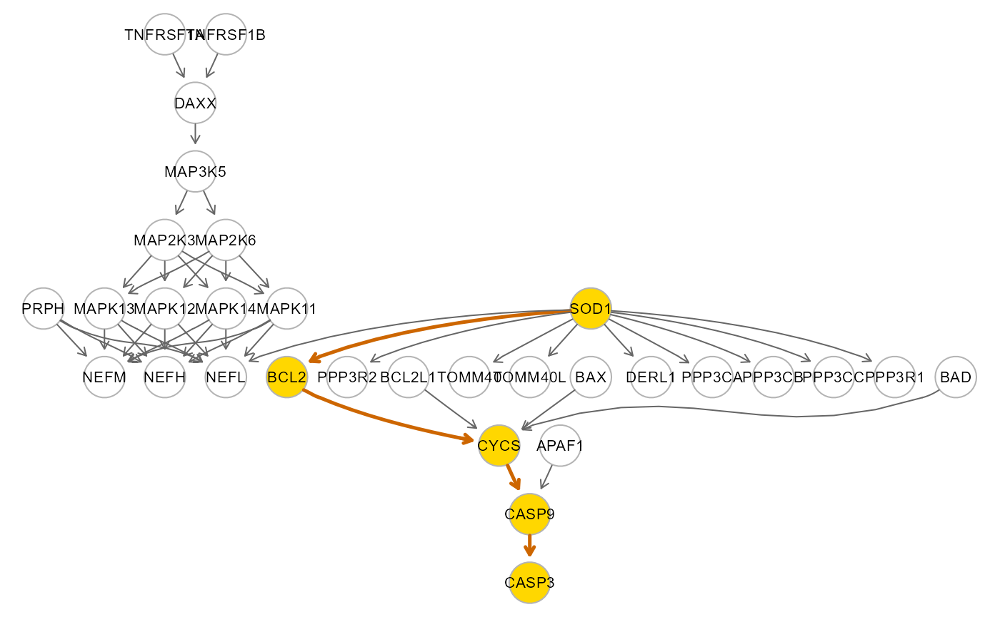
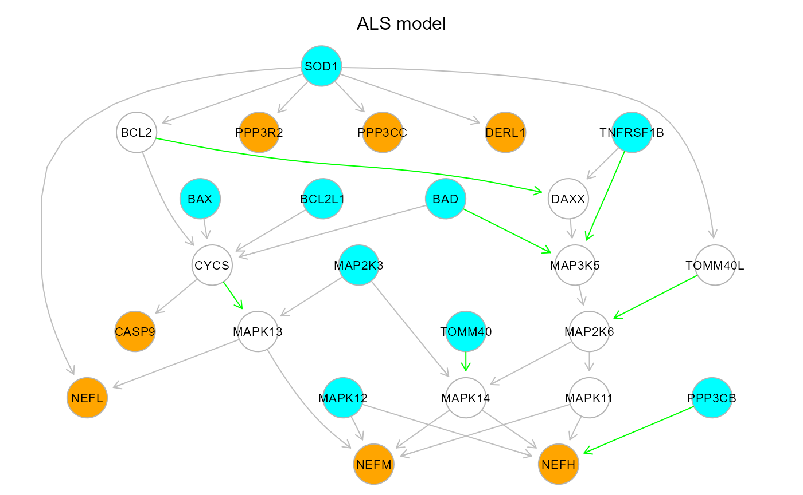
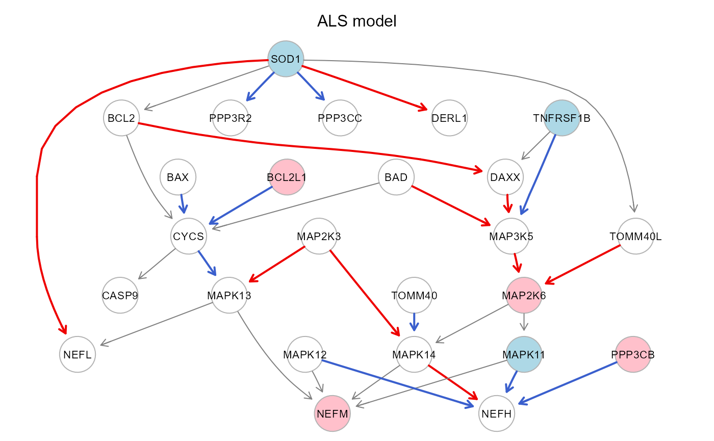
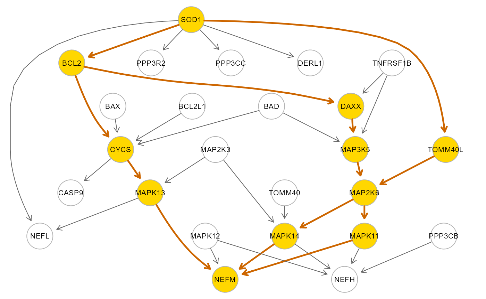
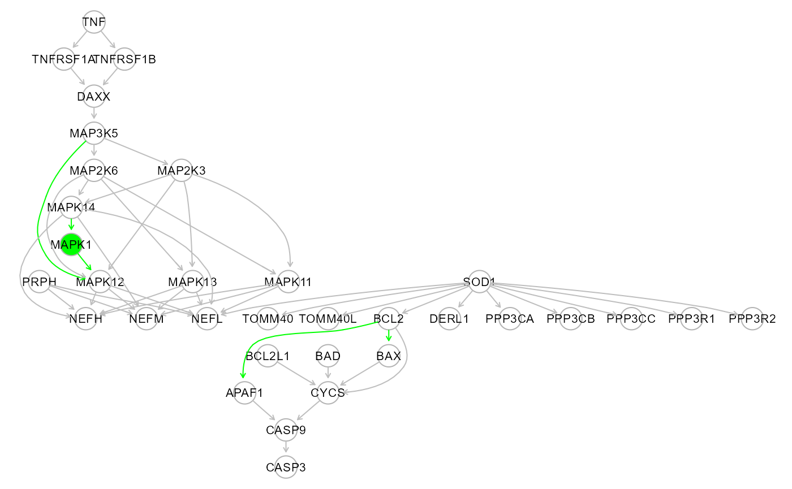
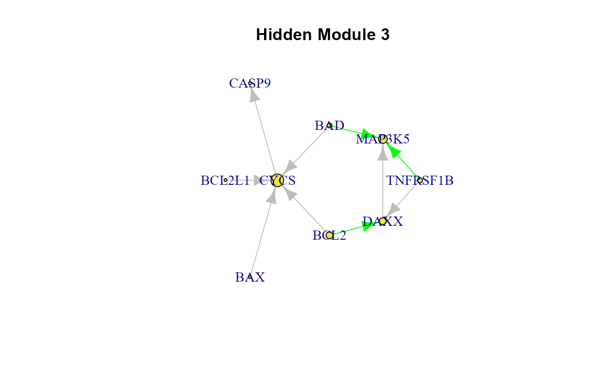
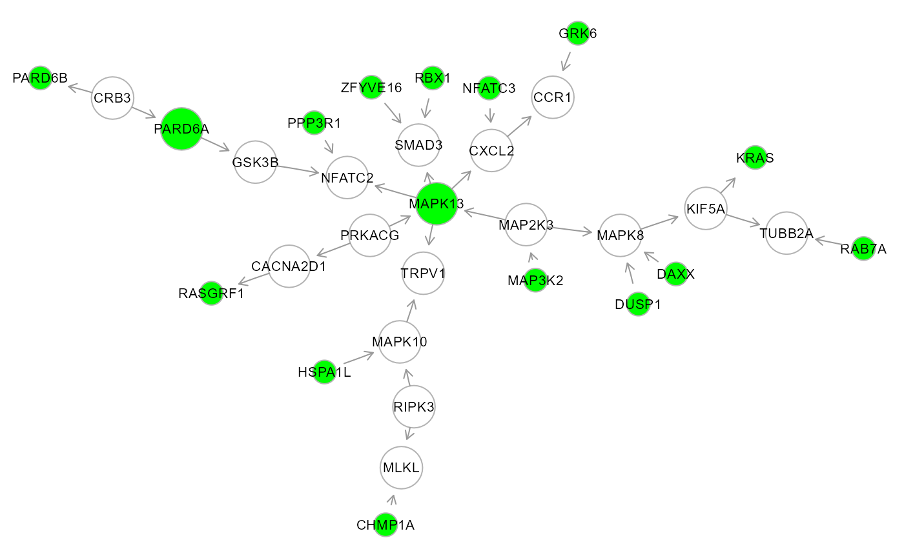

The following section offers an overview of **SEMgraph** functionalities. Starting from model fitting, it will gently introduce functions for model learning, weighting, clustering, and evaluation of causal effects and model perturbation. This section includes:

1. **Supplementary packages installation**
2. **Causal effects estimation, model learning, extension, and clusterinng (Amyotrophic Lateral Sclerosis dataset)**
3. **Gene Set Analysis and perturbed subnetwork/module extraction (Frontotemporal Dementia dataset)**

&nbsp;

## 1. Supplementary packages.

Besides the required packages, SEMgraph suggests the use of the R package **org.Hs.eg.db** in the Bioconductor project, for gene ID conversion.
SEMgraph uses entrez IDs to avoid special chatacters (such as hyphens or slashes), but it can use official gene symbols as labels.

```r
if (!require("BiocManager", quietly = TRUE))
    install.packages("BiocManager")

BiocManager::install("org.Hs.eg.db")
```

The package [**SEMdata**](https://github.com/fernandoPalluzzi/SEMdata) contains useful high-throughput sequencing data, reference networks, and pathways for SEMgraph training:

``` r
#devtools::install_github("fernandoPalluzzi/SEMdata")
```

&nbsp;

## 2. Amyotrophic Lateral Sclerosis (ALS) data analysis.

### 2.1. The ALS dataset.

Load the necessary libraries for run the tutorial:

```{r message=FALSE}
library(SEMgraph)
library(SEMdata)
library(org.Hs.eg.db)
```

**SEMdata** provides the ALS RNA-seq dataset of 139 cases and 21 healthy controls, from Tam O.H. *et al.*, 2019 (GEO accession: [GSE124439](https://www.ncbi.nlm.nih.gov/geo/query/acc.cgi?acc=GSE124439)). Raw data were pre-processed applying batch effect correction to remove data production center and brain area biases.
Using multidimensional scaling-based clustering, ALS-specific and HC-specific clusters were generated. Misclassified samples were blacklisted and removed from the dataset. Since the expression of many genes is significantly different from Gaussian, we apply a nonparanormal transform to relax the normality assumption.

```{r message=FALSE}
# ALS input graph
summary(alsData$graph)

# Label graph: Convert Entrez identifiers to gene symbols
V(alsData$graph)$label <- mapIds(org.Hs.eg.db, V(alsData$graph)$name,
                                 column = 'SYMBOL',
                                 keytype = 'ENTREZID')

# ALS RNA-seq expression data
dim(alsData$exprs)

# group = {1: case, 0: control} vector
table(alsData$group)

# Nonparanormal transform
data.npn <- transformData(alsData$exprs)$data

```

### 2.2. Model fitting.

**SEMgraph** offers three main modes of model fitting: (i) common model fitting, (ii) node perturbation evaluation, and (iii) edge perturbation evaluation. **SEMgraph** will automatically take care of applying shrinkage methods in case of high dimensionality (#variables >> #subjects), heuristics and parallelization settings for large graphs. In addition, perturbation evaluation enables the extraction of differentially regulated nodes (DRNs) and edges (DREs).

```{r}
# ALS model fitting (sem0)
# The whole dataset is used to fit the model and perturbation is not evaluated (group = NULL)
sem0 <- SEMrun(graph = alsData$graph, data = data.npn)

# verbose output
#summary(sem0$fit)
# short output
head(parameterEstimates(sem0$fit))


# ALS model fitting (sem1)
# Common model and group influence on nodes (node perturbation)

sem1 <- SEMrun(graph = alsData$graph, data = data.npn, group = alsData$group)

# verbose output
#summary(sem1$fit)
# short output
head(parameterEstimates(sem1$fit))

``` 

``` {r fig.show='hide'}
#Colored group effects on nodes and direct effects adjusted for group
#(red/pink: activation, blue/lightblue: repression)

gplot(sem1$graph, main="Colored ALS graph")
```

{width=95%}

```{r}
# ALS model fitting (sem2)
# One model for each group and group influence on edges (edge perturbation)

sem2 <- SEMrun(alsData$graph, data.npn, alsData$group, fit = 2)

# verbose output
#summary(sem2$fit)
# short output
head(parameterEstimates(sem2$fit))

# Perturbed graph elements

# Differentially Regualted Nodes (DRNs)
DRN <- sem1$gest[sem1$gest$pvalue < 0.05,]
nrow(DRN)
head(DRN)

# Differentially Regulated Edges (DREs)
DRE <- sem2$dest[sem2$dest$pvalue < 0.05,]
nrow(DRE)
head(DRE)


# Residual Iterative Conditional Fitting (RICF) 
# Fast node perturbation fitting for large graphs (SE estimation disabled)

ricf1 <- SEMrun(alsData$graph, data.npn, alsData$group, algo = "ricf")

head(parameterEstimates(ricf1$fit))

# Other possible output
#summary(ricf1$fit)
head(ricf1$gest)

# Constrained Gaussian Graphical Modeling (CGGM)
# Fast edge perturbation fitting for large graphs
cggm2 <- SEMrun(alsData$graph, data.npn, alsData$group, fit = 2, algo = "cggm")

head(parameterEstimates(cggm2$fit))

# Other possible output
#summary(cggm2$fit$Group_0)
#summary(cggm2$fit$Group_1)
head(cggm2$dest)

```

### 2.3. Total effect estimation as Average Causal Effect (ACE).

Suppose having a path P = X -> M1 -> ... -> Mk -> Y between two nodes X and Y, connected through k mediators. The total effect (TE = DE + IE) is the sum of the direct effect X -> Y, DE = b(X,Y), and the indirect effect through the mediators, IE = b(X,M1)\*b(M1,M2)\*...\*b(Mk,Y).
One convenient way of estimating the TE is through the definition of ACE by [Pearl J, 1998](https://doi.org/10.1177/0049124198027002004). The simplest estimation of the TE as ACE is possible in directed acyclic graphs (DAGs), thorugh linear regression. The parent set pa(X) of X blocks all backdoor (i.e., confounding) paths from X to Y, and the ACE is equal to the coefficient b(X,Y) in a multiple regression Y ~ X + pa(X).

```{r}
# Average Causal Effect (ACE)
# optimal adjustement set (type = "optimal")
# source -> sink ACE (effect = "source2sink")
# Benjamini-Hochberg multiple test adjustment (method = "BH")
# 5% significance level (alpha = 0.05)

ace <- SEMace(graph = alsData$graph, data = data.npn,
              type = "optimal", effect = "source2sink",
              method = "BH", alpha = 0.05)


# Sort by decreasing abs(z) value
ace <- ace[order(abs(ace$z), decreasing = TRUE),]
nrow(ace)
head(ace)


```{r fig.show='hide'}
# SOD1-CASP3 path extraction and fitting

source <- as.character(ace$source[6])
sink <- as.character(ace$sink[6])
path <- SEMpath(alsData$graph, data.npn, alsData$group,
                from = source, to = sink,
                path = "directed",
                verbose = TRUE)
```	
			
{width=95%}

```{r}
# Extract all directed paths, fit them, and evaluate their perturbation:

paths <- pathFinder(alsData$graph, data.npn, alsData$group, ace = ace)
print(paths$dfp)
```

### 2.4. Model estimation strategies.

The input graph is a picture of the current knowledge. Besides the evaluation of known relationships, data can be used to infer new ones. Four model search strategies are implemented in the `modelSearch` function. The *basic* one is completely data-driven and requires an input graph only to establish the initial topological order. In the *direct* strategy, The input graph structure is improved through direct (i.e., adjacent) link search, followed by reference-based ("gnet" argument) interaction validation and import from the reference network, with no mediators (d = 1). In the *outer* strategy, new interactions and connectors (i.e., mediators) will be searched and imported from the reference network. This strategy is analogous to the "outer" one, but disables external mediator search. In other words, new indirect paths are generated by adding new interactions between nodes only from the input model.

```{r}
# Model Search with search = "basic" and beta = 0.1
# The beta argument determines the minimum absolute LASSO coefficient
# for an edge to be included in the output model.
# Reducing beta (up to 0) will increase model complexity.

# This strategy is data-driven (gnet = NULL) and 
# only direct connections are added (d = 0; i.e., no new mediators),
# these edges are colored in green

model <- modelSearch(graph = alsData$graph,
                     data = data.npn,
                     gnet = NULL, d = 0,
                     search = "basic",
                     beta = 0.1,
                     method = "BH",
                     alpha = 0.05,
                     verbose = FALSE)

# Convert Entrez identifiers to gene symbols
V(model$graph)$label <- mapIds(org.Hs.eg.db, V(model$graph)$name,
                              column = 'SYMBOL',
                              keytype = 'ENTREZID')
```

```{r fig.show='hide'}
#Colored plot: orange/cyan: sink/source nodes, green/gray: new/old edges
gplot(model$graph, main="ALS model")
```

{width=95%}

```{r}
# Node perturbation of the ALS model
pert <- SEMrun(model$graph, model$data, alsData$group)
``` 
				
``` {r fig.show='hide'}
#Colored plot: red/pink: activation, blue/lightblue: repression
gplot(pert$graph, main="ALS model")
```

{width=95%}

```{r fig.show='hide'}
# SOD1-NEFM path extraction and fitting
path <- SEMpath(pert$graph, model$data, alsData$group,
                from = "6647", #SOD1
                to = "4741", #NEFM
                path = "directed",
                verbose = TRUE)
				
``` 

{width=95%}

Other possible strategies:

```{r}
# Direct strategy.
# - Knowledge-based estimation (gnet should be a directed reference network).
# - Only direct interactions are inferred (d is fixed to 1).
# - New interactions are inferred from data, during the execution.
# - A smaller starting beta value is suggested (beta = 0.05)

model1 <- modelSearch(graph = alsData$graph,
                      data = data.npn,
                      gnet = kegg, d = 1,
                      search = "direct",
                      beta = 0.05,
                      method = "BH",
                      alpha = 0.05,
                      verbose = FALSE)

# Inner strategy.
# - The reference network is used to validate new interactions and mediators.
# - Inferred mediators must already belong to the input graph.
# - Larger d values increase model complexity (suggested: d = 2).

model2 <- modelSearch(graph = alsData$graph,
                      data = data.npn,
                      gnet = kegg, d = 2,
                      search = "inner",
                      beta = 0.05,
                      method = "BH",
                      alpha = 0.05,
                      verbose = FALSE)

# Outer strategy.
# - Knowledge-based estimation (gnet should be a directed reference network).
# - Up to (d - 1) mediators can be imported from the reference network.
# - Larger d values increase model complexity (suggested: d = 2).

model3 <- modelSearch(graph = alsData$graph,
                      data = data.npn,
                      gnet = kegg, d = 2,
                      search = "outer",
                      beta = 0.05,
                      method = "BH",
                      alpha = 0.05,
                      verbose = FALSE)

# Outer strategy adds new nodes from kegg without node labels: 
V(model3$graph)$label <- mapIds(org.Hs.eg.db, V(model3$graph)$name,
                                'SYMBOL', 'ENTREZID')
```

```{r fig.show='hide'}
# graph models visualization:
par(mfrow=c(2,2), mar=rep(2,4))
gplot(model$graph, main="basic")
gplot(model1$graph, main="direct")
gplot(model2$graph, main="inner")
gplot(model3$graph, main="outer")
```

{width=95%}

&nbsp;

Step 1-3 of modelSearch() with search="outer" run the following functions:

```{r}
# Step 1: Bow-free Acyclic Path (BAP) search.

BAP <- SEMbap(graph = alsData$graph,
              data = data.npn,
              method = "BH", 
              alpha = 0.05,
              verbose = FALSE)

# Step 2: Directed Acyclic Graph (DAG) estimation.

DAG <- SEMdag(graph = alsData$graph,
              data = BAP$data,
              LO = "TO",
			  beta = 0.05,
              lambdas = NA,
              penalty = TRUE,
              verbose = FALSE)

# Step 3: Graph re-size with external interactome.

rsg <- resizeGraph(g = list(alsData$graph, DAG$dag.new),
                   gnet = kegg,
                   d = 2,
                   v = TRUE,
                   verbose = FALSE)
```

```{r fig.show='hide'}
V(rsg)$label <- mapIds(org.Hs.eg.db, V(rsg)$name, 'SYMBOL', 'ENTREZID')
gplot(rsg)
```

{width=95%}


### 2.5. Communities and factor scores.

The modular structure of biological networks could often reveal local effects and perturbed routes and communities hidden within a larger and more complex context. **SEMgraph** allows to detect and estimate these local properties as follows.

```{r}
# Improved ALS model (model$graph) clustering and scoring, using a latent variable
# "hidden" model (LV), edge betweeness clustering (EBC) algorithm, and a minimum 
# cluster size of 5 nodes.
# Other clustering algorithms can be exploited (e.g., the walktrap community 
# detection algorithm, WTC) to improve the interpretation of results.

LV <- clusterScore(model$graph, model$data, alsData$group,
                   type = "ebc",
                   HM = "LV",
                   size = 5)

table(LV$membership)

head(parameterEstimates(LV$fit))


# Clustering only (no scores calculation)

C <- clusterGraph(model$graph, type = "ebc", HM = "LV", size = 5)
```

```{r fig.show='hide'}
# Cluster plot utility

cg <- cplot(graph = model$graph, membership = LV$membership, verbose = TRUE)
```

{width=95%}
{width=95%}
{width=95%}

```{r}
list(cg)
```

```{r fig.show='hide'}
# Colored cluster plot: 

#Set label and node colors
V(cg$graph)$label <- mapIds(org.Hs.eg.db, V(cg$graph)$name,
                            column = 'SYMBOL',
							keytype = 'ENTREZID')

V(cg$graph)$color[V(cg$graph)$color == 2] <- "lightsalmon"
V(cg$graph)$color[V(cg$graph)$color == 3] <- "lightgreen"
V(cg$graph)$color[V(cg$graph)$color == 4] <- "lightyellow"

gplot(cg$graph)
```

{width=95%}

```{r}
# Cluster extraction, fitting, and perturbation evaluation

cls <- extractClusters(graph = model$graph,
                       data = model$data,
                       group = alsData$group,
                       membership = LV$membership)
print(cls$dfc)

```

&nbsp;

## 3. Frontotemporal Dementia (FTD) data analysis.

The FTD dataset coming with **SEMdata** is a data matrix of 256 rows (subjects; 150 FTD patients and 150 healthy controls) and 16560 columns (genes) containing the value of the first principal component of DNAme levels, obtained applying a principal component analysis to methylated CpG sites within the promoter region, for each gene (genes with unmethylated CpGs in both conditions were discarded). This dataset was derived from the study by Li Y. *et al.*, 2014 (GEO accession: [GSE53740](https://www.ncbi.nlm.nih.gov/geo/query/acc.cgi?acc=GSE53740)).

```{r}

# DNAme PC1 data
head(ftdDNAme$pc[, 1:5])
dim(ftdDNAme$pc1)

# Defining groups
group <- ftdDNAme$group
table(group)

# Nonparanormal transform
pc1.npn <- transformData(ftdDNAme$pc1)$data
head(pc1.npn[, 1:5])

```

### 3.1. Gene Set Analysis (GSA).

In absence of a conceptual model (i.e., one built from an expert's indication), the input graph can be inferred from data, literature or both of them. In the following example, we will take advantage of our FTD dataset and known FTD-associated pathways from the KEGG database. To this end, GSA can be used to assess the actual perturbation of known pathways, given data, and extract those genes (i.e., seeds) underlying perturbed routes. Seeds can also be defined using knowledge, such as importing a list of known disease-associated genes, or from other data sources (e.g. mutational, transcriptional, or epigenetic data).

```{r message=FALSE}

#load KEGG pathways
kegg.pathways <- SEMgraph::kegg.pathways
length(kegg.pathways) #225
head(names(kegg.pathways))

# Known FTD-related pathway selection

ftd.pathways <- c("MAPK signaling pathway",
                  "Protein processing in endoplasmic reticulum",
                  "Endocytosis",
                  "Wnt signaling pathway",
                  "Notch signaling pathway",
                  "Neurotrophin signaling pathway")

# Pathway extraction

j <- which(names(kegg.pathways) %in% ftd.pathways)

# Gene set analysis (GSA) with 5000 permutations

ftd.gsa <- SEMgsa(kegg.pathways[j], pc1.npn, group, n_rep = 5000)
print(ftd.gsa$gsa)

# Seed extraction

seed <- unique(unlist(ftd.gsa$DEG))
length(seed) #60

```

### 3.2. Network weighting and perturbed backbone extraction.

While seeds pinpoint nodes with specific properties, edges can be weighted on the base of quantitative and phenotype data to define preferential ways of information exchange (e.g., perturbation propagation) through the network. **SEMgraph** offers different alternatives to generate data-driven weights, but the fastest of them is based on the Fisher's "r-to-z" method, to test the group difference between correlation coefficients of pairs of interacting nodes (Fisher, 1915). Both seeds and weights can be used to extract the perturbed core(s) of a network to highlight its disease-associated components.

```{r message=FALSE}
# KEGG interactome weighting

#load KEGG interactome
kegg<- SEMgraph::kegg
summary(kegg) #DNW- 5007 44755

W <- weightGraph(kegg, pc1.npn, group, method = "r2z")
summary(W) #DNW- 4242 34975 

# Perturbed backbone as a Steiner tree (Kou's algorithm)
# A Steiner tree is the minimum cost (distance) graph
# including all the specified seeds.

ST <- SEMtree(W, data = pc1.npn, seed = seed, type = "ST", eweight = "pvalue")
summary(ST) #DNW- 92 (90 directed + 1 bidirected)
```

```{r fig.show='hide'}
# Colored plot: green, seed nodes; white, connection nodes
gplot(ST, l="fdp")
```

{width=95%}

```{r}
# Perturbation evaluation with raw data

sem1 <- SEMrun(ST, pc1.npn, group)

# Data deconfounding and perturbation evaluation

# When a DAG is used for causal network inference, missing edges 
# are often masked by unmeasured confounding variables.
# This step might reduce this effect through Bow-free Acyclic Path (BAP) 
# search and data deconfounding.

adj.pc1 <- SEMbap(ST, pc1.npn, method = "bonferroni", alpha = 5E-06)
adj.sem1 <- SEMrun(ST, adj.pc1$data, group)
```

```{r fig.show='hide'}
#Colored plot: red/pink: activation, blue/lightblue: repression
gplot(adj.sem1$graph, l="fdp")
```

{width=95%}

```{r}
# Tree agglomerative hierarchical clustering (TAHC).
# This allow us to detect possible communities within our Steiner tree.

C <- clusterGraph(ST, type = "tahc")
cg <- cplot(ST, membership=C)
summary(cg)
```

```{r fig.show='hide'}
#Colored plot: set 2nd cluster (HM2), node color and size
cg2 <- cg$HM2
V(cg2)$color <- ifelse(V(cg2)$name %in% seed, "green", "white")
V(cg2)$size <- 3*degree(cg2, mode="total")

# Convert Entrez identifiers to gene symbols
V(cg2)$label <- mapIds(org.Hs.eg.db, V(cg2)$name, 'SYMBOL', 'ENTREZID')

# Plot cluster (green nodes are seed nodes)
gplot(cg2, l = "neato")
```

{width=95%}

### 3.3. Locating differentially connected genes.

The SEMgraph differential connected inference (DCI) module enables the detection of perturbed nodes and edges for large graphs. This module is useful when the aim is to find a perturbed backbone of essential disease-associated nodes nodes.

```{r warning=FALSE}
# Input graph as the union of FTD KEGG pathways

gU <- Reduce(igraph::union, kegg.pathways[j])
gU <- properties(gU)[[1]]
summary(gU) #DNW- 586 3572

# DCI with the WTC clustering algorithm

gD <- SEMdci(gU, pc1.npn, group, type = "wtc", method = "BH", alpha = 0.05)
summary(gD) #DN-- 74 61

# Perturbation evaluation of the 1st component of gD

gC1 <- properties(gD)[[1]]
sem1 <- SEMrun(gC1, pc1.npn, group)
sem2 <- SEMrun(sem1$graph, pc1.npn, group, fit = 2)
```

```{r fig.show='hide'}
# Colored DCI plot
gC1 <- sem2$graph

# Convert Entrez identifiers to gene symbols
V(gC1)$label <- mapIds(org.Hs.eg.db, V(gC1)$name, "SYMBOL", "ENTREZID")
# Set node size
V(gC1)$size <- 1.5*degree(gC1, mode="total")

gplot(gC1, l="neato")
```

{width=95%}

Note: the global statistics suggest a poor fit, and de-correlation could be performed; however, a significant perturbation
between the two conditions is observed, as shown in the extracted subgraph by pink (beta > 0: activation) or light blue
(beta < 0: repression) nodes, and red (delta > 0: activation) or blue (delta < 0: repression) edges, respectively.

&nbsp;

## References

[Supplementary material](https://oup.silverchair-cdn.com/oup/backfile/Content_public/Journal/bioinformatics/38/20/10.1093_bioinformatics_btac567/1/btac567_supplementary_data.pdf?Expires=1767731027&Signature=o20YJlVgCpAI7ZHJQQw-rFOtX3kKhcHF7SUYuAIe41hFelCUY3q7D5KHk-EbhLQAyDrTQL-MiwuKiPorExwUeGBLQ1wo5XwDOfrTEiqXxl~CW0lOK4peJjn9fBkI95Hk7cvKDd1OQud9R8pQp32~VykXlIDZ3NnRk-BUCRR4fF8Yj0lmZEAevaTJ27OtMBq4TkpFxKEpy9P3eB3ufmVs6hXsWnfm5Eh4vDSf9yH8O4Wj498Su1BB6V2MvkScsKhbHkSJDAVBaCOoI1q4EDUwr28shYzKGcohnxPlTcK9KYne~bie4YUZSB4anH0SweKv~7gNGyy5B6zVen3WfvOF9A__&Key-Pair-Id=APKAIE5G5CRDK6RD3PGA) of
Grassi M, Palluzzi F, Tarantino B. **SEMgraph: an R package for causal network inference of high-throughput data with structural equation models**. Bioinformatics, 2022 Aug 30; 38(20):btac567. https://doi.org/10.1093/bioinformatics/btac567
